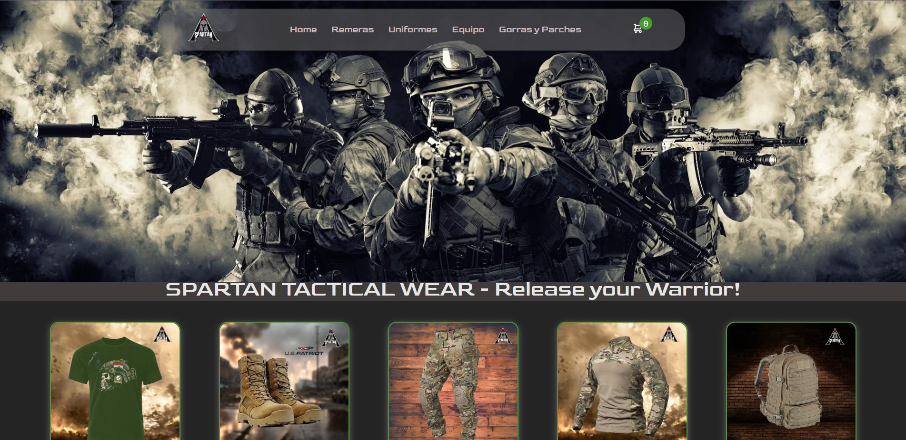

# Spartan Tactial Wear Ecommerce first React app CoderHouse2023

- The purpose of this project was to show the skills learned during the React course.
- The subject app is a web app for those who love outdoor activities and airsoft fans. 
- The web app allows you to select a product and purchase it showing all the techniques during the course.

## Available Scripts

In the project directory you can run:

### `npm run dev`

Running the app in the development mode.\
Open [http://localhost:5173/](http://localhost:5173) to view it in your browser.

## Technologies used

- **React**: La interfaz de usuario se elaboro enteramente utilizando esta libreria para aplicar un metodologia modular de programacion de componentes.
- **Vite**: Ofrece un entorno de desarrollo rápido, fácil de configurar y optimizado para la producción, mejorando la productividad y la eficiencia del desarrollo.
- **Dev Web Tools**: CSS - HTML - Js

